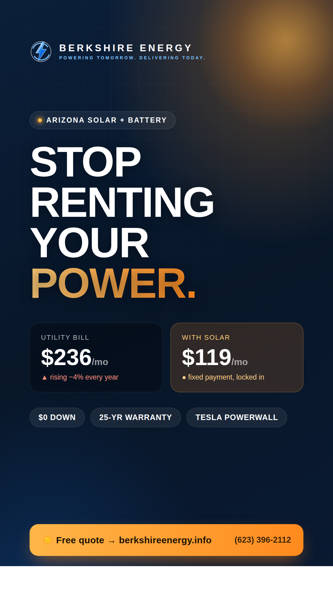
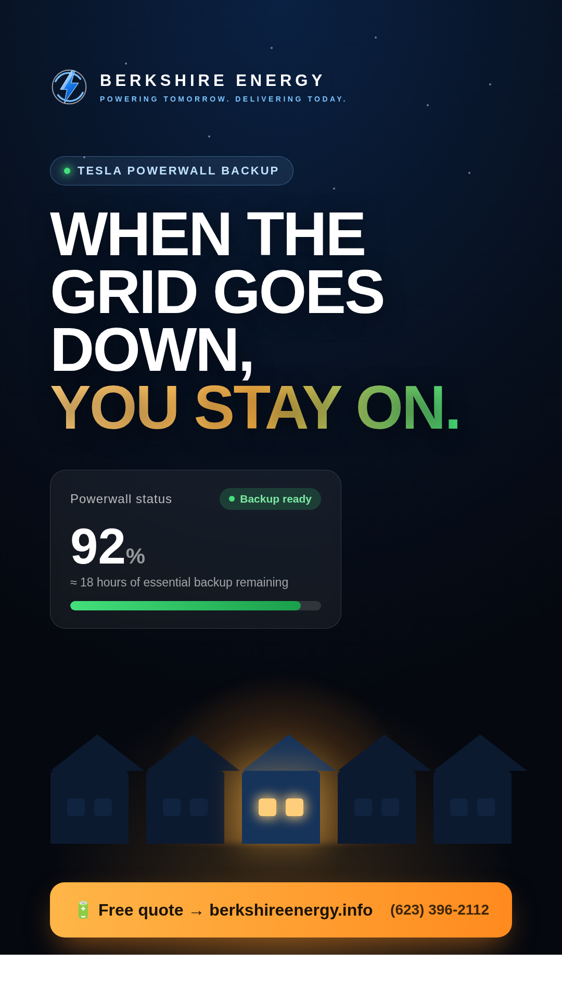

# Berkshire Energy — Instagram Reels

Two production-ready Reel scripts for **@berkshireenergy** (Arizona residential
solar + Tesla Powerwall). Built from the brand voice on berkshireenergy.info:
confident, local, anti-high-pressure — *"Own your power. Stop renting it."*

**Format for both:** 9:16 vertical · 1080×1920 · 20–30s · captions burned in
(85% of Reels are watched on mute) · safe margins kept clear of the IG UI
(top ~220px, bottom ~250px, right ~100px).

> **⚠️ Compliance note (read before posting).** The FTC bans invented or
> AI-generated testimonials and specific savings claims you can't substantiate.
> The dollar figures below are **illustrative** and are framed that way on
> screen ("example," "your numbers will vary"). Before using any real customer
> quote, bill photo, or "$X → $Y" result, get written permission and keep proof
> on file. This mirrors the placeholder warning already in `src/app/page.tsx`.

**Cover images:** Ready-to-use 1080×1920 PNG covers/thumbnails for each Reel are
embedded below and live in [`assets/`](assets/). The editable source is the
matching `.html` file (re-render with headless Chromium at a 1080×1920 window).

---

## Reel 1 — "Stop Renting Your Power"

**Angle:** The rising-utility-bill pain point + $0-down switch. Hook with the
summer bill shock every Phoenix homeowner feels.
**Goal:** Drive free-quote requests.
**Runtime:** ~24s.

### Shot list

| Time | Visual | On-screen text | Voiceover / audio |
|------|--------|----------------|-------------------|
| 0:00–0:03 | Close-up of an APS/SRP bill, finger scrolls to the total. Quick zoom-punch on the number. | **"Your July bill in Arizona:"** then a big **$300+** stamps on | VO: *"If you live in the Valley, you already know what summer does to this."* |
| 0:03–0:08 | Time-lapse of a blazing AZ sky / AC unit running, heat-shimmer. | **"And the utility raises rates almost every year."** | VO: *"You pay more every year — and you'll never own a thing."* |
| 0:08–0:13 | Whip-pan to a sunny rooftop; solar panels snap into place with a satisfying motion graphic. | **"What if that money bought something instead?"** | VO: *"Berkshire Energy turns that same money into solar you actually own."* |
| 0:13–0:19 | Split screen: left "Renting from the utility — $0 owned" vs right "Solar — fixed payment, you own it." Right side fills with a green savings bar. | **"$0 down. Fixed payment. 25-year warranty."** | VO: *"Often a lower monthly payment than your bill today — with nothing down."* |
| 0:19–0:24 | Berkshire logo + tidy installed array, sun flare. End card with CTA. | **"Get your free, no-pressure quote ☀️"** + `berkshireenergy.info` | VO: *"Stop renting your power. Own it. Link in bio for a free quote."* |

**Audio:** Upbeat, trending licensed track from the IG audio library (use a
*currently trending* sound for reach — swap weekly). Duck music ~6dB under VO.

**Hook variants to A/B test (first 3s):**
- "POV: it's 115° and your power bill just hit $312."
- "Arizona, your electric bill is a rent check you'll never stop paying."
- "Three numbers every Phoenix homeowner should know before next summer."

### Caption

> Your Arizona power bill goes up almost every single year — and you never own
> a thing. ☀️
>
> Berkshire Energy designs custom solar + battery for AZ homes and swaps that
> rising utility bill for a fixed payment you control — often lower, and with
> **$0 down**. You own the system. You own the power.
>
> 🔋 Tier-1 panels + Tesla Powerwall
> 📍 Local Valley team
> 🛡️ 25-year equipment & production warranty
> 💬 Transparent pricing — no "sign today" games
>
> Already have a quote? Bring it. We'll go head-to-head and beat it, or tell
> you straight if yours is already great.
>
> 👉 Free, no-pressure quote — link in bio or call (623) 396-2112.
>
> *Savings are illustrative; your numbers come from your roof and usage.*

### Hashtags
`#ArizonaSolar #PhoenixSolar #GoSolar #SolarPower #TeslaPowerwall #SolarEnergy #ArizonaHomeowners #EnergyIndependence #SolarSavings #APS #SRP #ValleyOfTheSun #RenewableEnergy #SolarPanels #BerkshireEnergy`

---

## Reel 2 — "When the Grid Goes Down"

**Angle:** Tesla Powerwall backup. Highly visual, emotional payoff — your house
stays lit while the street goes dark. Differentiates from cheaper solar-only bids.
**Goal:** Position battery storage + drive quotes.
**Runtime:** ~22s.

### Shot list

| Time | Visual | On-screen text | Voiceover / audio |
|------|--------|----------------|-------------------|
| 0:00–0:03 | Night street. Lights flicker, then a whole block snaps to black. One house stays glowing. | **"The whole street lost power last night."** | SFX: power-down hum, then silence. VO: *"Monsoon hit. The grid went down."* |
| 0:03–0:08 | Inside the lit house: AC humming, kid doing homework, fridge light on — totally normal. | **"This house didn't even flicker. 🔋"** | VO: *"This home barely noticed."* |
| 0:08–0:13 | Phone screen: Powerwall app at **92% · Backup ready**, solar feeding the battery. | **"Tesla Powerwall = automatic whole-home backup."** | VO: *"Solar charges the Powerwall by day. At night — or in an outage — your home runs on it."* |
| 0:13–0:18 | Morning: panels in sun, battery recharging animation. Quick hits of icons: backup / beat peak rates / energy independence. | **"No generator. No noise. No fuel."** | VO: *"No generator, no gas, no noise. It just works."* |
| 0:18–0:22 | Berkshire end card, installed system at golden hour, CTA. | **"Add battery backup to your home ☀️🔋"** + `berkshireenergy.info` | VO: *"Berkshire Energy. Keep your lights on. Link in bio."* |

**Audio:** Start tense/quiet (the outage), lift into a warm, hopeful track at
the 0:03 reveal when the lit house appears. Trending calm-to-uplift sound works
well here.

**Hook variants to A/B test (first 3s):**
- "The entire block lost power. Watch the one house that didn't."
- "Monsoon season in Arizona is here. Is your home ready for the next outage?"
- "Your neighbors are sitting in the dark. You're watching TV. Here's why."

### Caption

> Monsoon season + an aging grid = outages. ⚡ When the power drops on your
> street, your home doesn't have to go with it.
>
> Pair your solar with **Tesla Powerwall** and your panels charge the battery
> all day — so at night, during peak rates, or in an outage, your home runs on
> stored sunshine. Automatically. No generator, no fuel, no noise.
>
> 🔋 Whole-home backup that kicks in on its own
> 💸 Beat expensive peak utility rates
> 🏠 Real energy independence in the Valley
> 🛡️ Backed by a 25-year warranty
>
> Built for Arizona summers by a local team that knows what 115° does to your
> grid — and your bill.
>
> 👉 See what battery backup looks like for your home — free quote in bio, or
> call (623) 396-2112.

### Hashtags
`#TeslaPowerwall #BatteryBackup #ArizonaSolar #PhoenixSolar #PowerOutage #MonsoonSeason #EnergyIndependence #SolarPlusStorage #GoSolar #ArizonaHomeowners #APS #SRP #SolarPower #ValleyOfTheSun #BerkshireEnergy`

---

## Production checklist

- [ ] Shoot/source **vertical 9:16** footage (or license stock + AZ rooftop b-roll).
- [ ] Burn in captions; verify legibility on mute and inside IG safe margins.
- [ ] Use a **currently trending** licensed audio track (refresh weekly for reach).
- [ ] Keep the **hook in the first 3 seconds** — that's where retention is won/lost.
- [ ] Add a clear end-card CTA: free quote · link in bio · (623) 396-2112.
- [ ] Cover image / thumbnail with a bold 3–4 word line for the grid.
- [ ] Confirm any real customer footage/quote has **written consent** on file.
- [ ] Post timing: test weekdays ~11a–1p and ~6–8p MST; reply to early comments fast.
- [ ] Cross-post to Stories + Facebook; pin the best performer to the profile grid.

## Suggested posting cadence

1. **Week 1:** Reel 1 ("Stop Renting Your Power") — broad pain-point reach.
2. **Week 2:** Reel 2 ("When the Grid Goes Down") — retarget engagers, lead into
   monsoon season.
